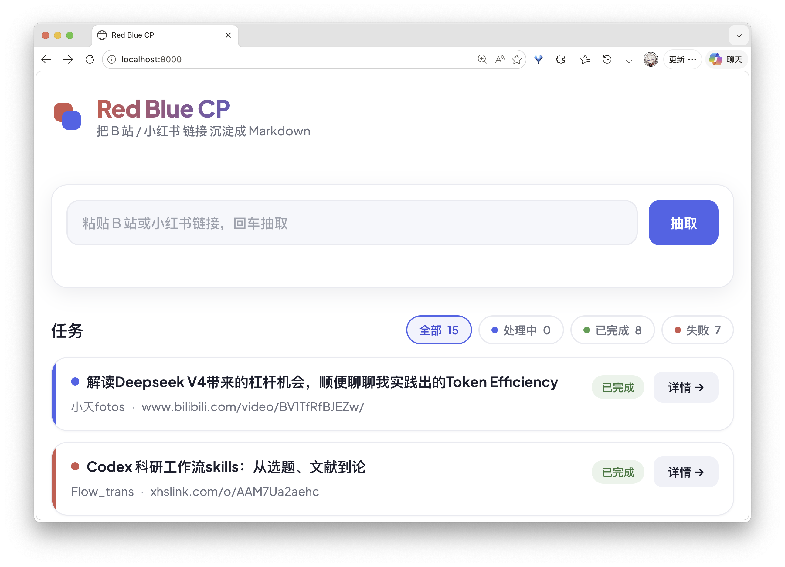
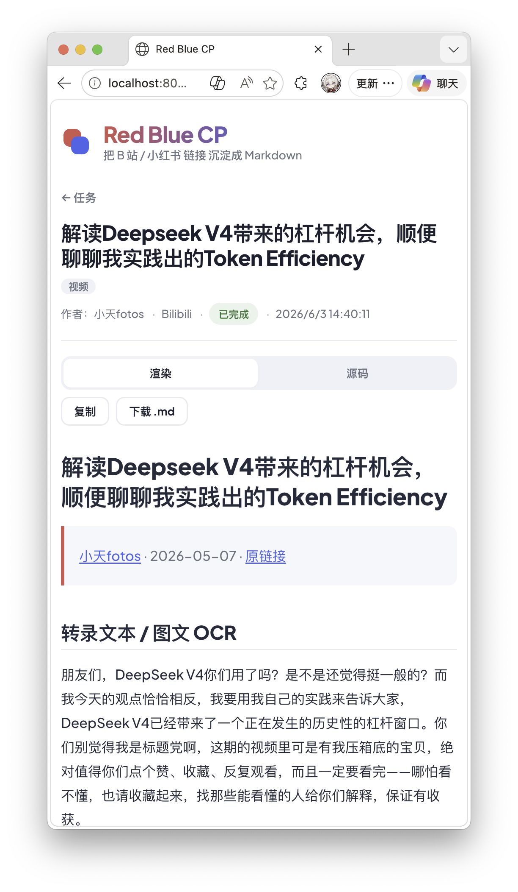

<p align="center">
  
</p>

<p align="center">
  <strong>自古红蓝出 CP —— 把 B 站和小红书内容转成本地 Markdown 知识库</strong>
</p>

<p align="center">
  <a href="https://pypi.org/project/red-blue-cp/"></a>
  <a href="https://pypi.org/project/red-blue-cp/"></a>
  <a href="./LICENSE"></a>
</p>

<!-- <p align="center">
  <a href="./README.en.md">English</a>
</p> -->

<p align="center">
  
</p>

粘一个链接，得到一篇 Markdown。支持 B 站视频、小红书视频、小红书图文，自动转录/识别文字，多人对谈标注说话人。还能批量下载整个博主、连评论一起存。

## 快速开始

**前置**：Python ≥ 3.11，[百炼 API Key](https://bailian.console.aliyun.com/)（ASR / VLM 用）。

### 1. 安装

```bash
# 推荐：从 PyPI 装，命令直接是 rbcp
pipx install red-blue-cp

# 或源码安装（开发用）
git clone https://github.com/MuChengZJU/red-blue-cp.git
cd red-blue-cp && uv sync
```

### 2. 配置

```bash
# PyPI 安装：配置文件放 ~/.config/rbcp/.env
mkdir -p ~/.config/rbcp && cp .env.example ~/.config/rbcp/.env

# 源码安装：配置文件放仓库根目录
cp .env.example .env
```

编辑 `.env`，填入 `DASHSCOPE_API_KEY`。单篇公开内容只需这一个 key。

### 3. 使用

```bash
# 打开网页界面（推荐）
rbcp serve                     # 浏览器访问 http://localhost:8000

# 或命令行直接转
rbcp run "B站或小红书链接"
```

> 源码安装的命令前加 `uv run`，如 `uv run rbcp serve`。

## 功能

- **视频转录** — B 站视频优先取字幕，无字幕走 ASR（百炼 Paraformer）
- **图文识别** — 小红书图文用 VLM（百炼 Qwen-VL）识别图片内容
- **说话人分离** — 多人对谈自动标注「说话人 1 / 2 / ...」
- **博主安全批量** — 浏览器插件抓清单 → `rbcp batch notes.json --proxy ...` 走代理批量下载（断点续传、token 过期跳过、失败不中断）。详见 [安全批量](#安全批量博主全量)
- **评论提取** — `rbcp fetch "<笔记链接>" --comments`，含楼中楼
- **扫码登录** — `rbcp login` 弹浏览器扫码，cookie 本地复用
- **粘贴即用** — 直接粘贴整段分享文案（带标题/中文尾/emoji 都行），自动抽 URL 去追踪参数

评论功能需要登录态 + 系统安装 Chrome/Edge。

## 安全批量（博主全量）

把整个博主的笔记安全批量转成 Markdown：**插件只在你登录态的浏览器里抓清单（有风控的部分），rbcp 只下载+转录（走代理护 IP）**——职责分离，比让脚本驱动浏览器抓全量安全得多。

```
[浏览器插件] 博主主页慢滚到底 → 导出 notes.json
        ↓ 上传 / 粘贴
[rbcp batch notes.json --proxy http://127.0.0.1:7897]  逐条走代理下 → Markdown
   或 WebUI: rbcp serve → /batches 上传/粘贴 notes.json，看进度
```

1. 装插件：`chrome://extensions` → 开发者模式 → 加载已解压 → 选 `extension/` 目录（见 [extension/README.md](extension/README.md)）。
2. 打开小红书博主主页，**手动慢慢滚到底**（慢滚最安全），点插件图标导出 `notes.json`。
3. `rbcp batch notes.json --proxy <你的代理>`（或 WebUI `/batches` 导入）。代理两种模式见 [博主安全批量功能文档](docs/blogger-safe-batch-feature.md)。

> 旧路径 `rbcp fetch "<博主主页>" --all`（pydoll 驱动 Chrome 抓清单 + 串行下）仍保留，但**不再是主路径**——自动化痕迹易被识别、不可分发。优先用插件 + `rbcp batch`。

## 给 AI Agent 用

rbcp 把 B 站和小红书统一成了结构化接口。AI Agent 可以直接调 CLI 做内容调研——拿博主清单、按规则筛选、逐条下载、读取 Markdown 结果，整个流程无需人工介入。

```bash
# Agent 典型工作流：
rbcp fetch "<笔记链接>" --json              # 单条下载，拿到 Markdown 路径
rbcp batch notes.json --proxy <代理> --json # 批量：消费插件导出的清单，走代理逐条下
rbcp fetch "<博主主页>" --all --json --yes   # 旧路径：pydoll 抓清单 + 串行下（脚本化场景）
```

所有命令加 `--json` 即输出机器可读的 JSON。字段契约和完整性标记（`complete: true/false`，区分"拉全了"还是"被风控截断"）见 [SPEC.md](./SPEC.md)。

## WebUI

网页界面支持桌面和移动端。粘贴链接提交后可实时查看任务状态，完成后直接预览渲染好的 Markdown。

<p align="center">
  
</p>

## 开发

```bash
uv sync                    # 安装依赖
uv run pytest              # 跑测试
uv run rbcp serve          # 本地起服务
```

技术栈：FastAPI + Jinja2 + HTMX + Typer + SQLite + asyncio。博主清单抓取主路径是浏览器插件（MV3，独立 JS，在 `extension/`）；下载走代理（`requests` 显式 proxies）。评论 / 旧版 `--all` 抓清单用 [pydoll](https://github.com/pydoll-project/pydoll)（CDP 连系统 Chrome）。

```
app/
├── service/          # 核心逻辑：抓取、转录、Markdown 生成、存储、批量、错误
├── web/              # WebUI + REST API
└── cli.py            # CLI 入口
extension/            # 浏览器插件（MV3，抓博主清单导出 notes.json）
```

## 文档

| 文档 | 内容 |
|---|---|
| [PRD.md](./PRD.md) | 产品需求、定位、排期 |
| [SPEC.md](./SPEC.md) | 技术规格、API、数据模型 |
| [PLAN.md](./PLAN.md) | 里程碑进度 |
| [LOG.md](./LOG.md) | 演进日志（决策 / 开发 / 经验） |

## License

[MIT](./LICENSE)
